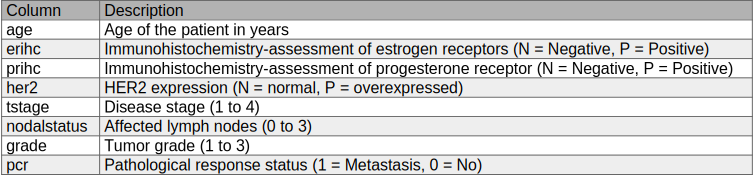
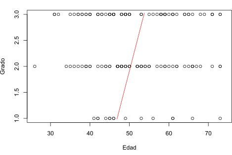

```{r setup, include=FALSE}
library(knitr)
local({
  hook_plot = knit_hooks$get('plot')
  knit_hooks$set(plot = function(x, options) {
    x = paste(x, collapse = '.')
    if (!grepl('\\.svg', x)) return(hook_plot(x, options))
    # read the content of the svg image and write it out without <?xml ... ?>
    paste(readLines(x)[-1], collapse = '\n')
  })
})
```


## **Modelos de Aprendizaje automático**


El objetivo de esta actividad es diseñar modelos predictivos de respuesta completa patológica (PCR) en cáncer de mama neoadyuvante a partir de los datos proporcionados (información clínica-patológica y de expresión genética). Se estudiará si el uso de la información genética permite mejorar los resultados obtenidos mediante un modelo que utilice exclusivamente la información clínico-patológica.

<br>

<center>

</center>
<br>
Una pequeña descripción del dataset utilizado:

> _Patients with clinical `stage I to III` breast cancer were elegible. Histologic diagnosis of invasive cancer and `ER`, progesterone receptor (`PR`), and `HER2` receptor status were determined from a diagnostic core needle or incisional biopsy before therapy. Gene expression profiling on `Affymetrix U133A` gene chips._
<br>

<br>

## &nbsp; &nbsp; &nbsp; Secciones del documento:

&nbsp; &nbsp; &nbsp; **1.** [Introducción](#id1)

&nbsp; &nbsp; &nbsp; **2.** [Datos y algoritmos de clasificación utilizados](#id2)

&nbsp; &nbsp; &nbsp; **3.** [Resultados](#id3)

&nbsp; &nbsp; &nbsp; **4.** [Conclusiones](#id4)


<br>

<br>

### *Introducción*<a name="id1"></a>


En primer lugar vamos a cargar los datos, para así ver la forma en la que vienen:

```{r echo = FALSE}
datos_AF <- read.table(file="data.csv", dec=",", sep=";", header=T, stringsAsFactors=T)
```

```{r eval = FALSE}
datos_AF <- read.table(file="data.csv", dec=",", sep=";", header=T, stringsAsFactors=T)

ncol(datos_AF) # Número de columnas del dataset
```

<pre><code class="hljs">13524</code></pre>

```{r eval = FALSE}
nrow(datos_AF) # Número de filas del dataset
```

<pre><code class="hljs">178</code></pre>

<br>
Podemos ver que los datos tienen `178` filas/instacias y `13524` columnas/características, de las cuales `8` son las que corresponden a información clínica-patológica. Por tanto, podemos ver que la cantidad de datos que tenemos sobre los genes superan por mucho a la información clínica.

<blockquote>
<center>
{ width=80% }
</center>
</blockquote>

<br>
Como más adelante utilizaré solamente la parte `clínica-patológica` voy a crear un dataframe con exclusivamente esa parte:

```{r Clinic Read}
datos_AF_clinico <- datos_AF[0:8]
datos_AF_clinico
```


Un descripción más detallada de las caracteríticas clínica-patológicas de los datos: <br>

<center>

</center>

<br>
<br>

### *Datos y algoritmos de clasificación utilizados*<a name="id2"></a>

Realizaré una comparación de los modelos de `regresión logística`, `ANN`, `SVM` y `árboles de decisión`, comparando los resultados en base a las métricas propuestas, implementando el procedimiento de `5x2 cross-validation`  usando el área bajo la curva ROC, precisión, recall y f1-score como métricas de evaluación del rendimiento del modelo.

<br>

#####  • Estadística descriptiva e inferencia estadística de las variables clínico-patológicas y su respuesta

&nbsp; &nbsp; &nbsp; &nbsp; &nbsp; &nbsp; &nbsp; &nbsp; &nbsp; &nbsp; <span style="color: dodgerblue;">▸</span>  Representación de la variable `grade`:


```{r fig.align='center', dev='svglite'}
barplot(table(datos_AF_clinico$grade)
        , main = "Representación Grado del tumor"
        , ylab = "Frecuencia"
        , xlab = "Número del Grado"
        , col = c("#d0e0fc","#71a3f7","#3366d6")
        )
```
<center>
</center>


Podemos ver como, entre los datos, hay más instancias con la característica de `grade` 3 siendo el `grade` 1 el menos representado

<br>

&nbsp; &nbsp; &nbsp; &nbsp; &nbsp; &nbsp; &nbsp; &nbsp; &nbsp; &nbsp; <span style="color: dodgerblue;">▸</span>  Representación de diagrama de caja de la variable `age`:

```{r dev = "svglite", fig.align = 'center'}
boxplot(datos_AF_clinico$age
        , col = "#fc8028"
        , main = "Representación de la Edad"
        )
```

<br>

Viendo la representación `Box-Plot` de la edad, podemos ver que la variable `age` tendría representación de valores entre 75 y 25 aproximadamente. Además, esta variable tendría asimetría positiva ya que la parte más larga de la caja es la parte superior a la mediana. 

<br>

```{r include = FALSE}
numero_minimo <- 1
numero_maximo <- 49
# create data frame
df <- data.frame(
  id = numero_minimo:numero_maximo
  , Coolness_Level = numero_minimo:numero_maximo
  , Coolness_Color = NA
  , stringsAsFactors = FALSE
)
color.function <- colorRampPalette(c( "#CCCCCC" , "#df9560" ), interpolate = "spline")
color.ramp <- color.function( n = nrow( x = df ) )
df$Coolness_Color <-
  as.character(
    x = cut(
      x = rank( x = df$Coolness_Level )  # used to assign order in the event of ties
      , breaks = nrow( x = df )  # same as the 'n' supplied in color.function()
      , labels = color.ramp  # label the groups with the color in color.ramp
    )
  )
```

&nbsp; &nbsp; &nbsp; &nbsp; &nbsp; &nbsp; &nbsp; &nbsp; &nbsp; &nbsp; <span style="color: dodgerblue;">▸</span>  Representación de las distribuciones de `receptores de estrógeno` respecto a la `edad`:

```{r dev = "svglite"}
# La función table construye una tabla de resúmenes de datos para las distribuciones parciales de las etiquetas de cada variable
tabla_bar_plot <- table(datos_AF_clinico$age, datos_AF_clinico$erihc)
```

```{r dev = "svglite", fig.align = 'center'}
barplot( height = tabla_bar_plot
         , names=c("Negative","Positive")
         , las = 1
         , col = df$Coolness_Color
         , border = NA
         , main = "age vs erihc"
         , ylab = "Frecuencia"
         , beside=TRUE
         , legend.text = T
         , args.legend = list(x="bottomleft", inset=c(-0.1,-0.3), bty="n", cex=0.69, ncol = 17)
)
```

Aquí podemos ver que la distribución de la edad entre los dos grupos de receptores de estrógeno (`erihc`) es similar

<br> <br>

&nbsp; &nbsp; &nbsp; &nbsp; &nbsp; &nbsp; &nbsp; &nbsp; &nbsp; &nbsp; <span style="color: dodgerblue;">▸</span> Modelado la `edad` en función del `grado` del tumor


```{r eval = FALSE}
mod_lin <- lm(age ~ grade, data = datos_AF_clinico) # Edad en función del grado
plot(datos_AF_clinico$age, datos_AF_clinico$grade, xlab = "Edad", ylab = "Grado")

abline(mod_lin, col = "red") # Representación de la recta
```

<center>
{ width=60% }
</center>

En esta representación podemos ver como el modelado lineal indica una pequeña tendencia: A más edad, el grado del tumor puede llegar a ser más alto.

<br>
<br>
<br>

###### <span style="color: dodgerblue;">▸</span> Selección de variables

Para la búsqueda de firmas genéticas (combinación de genes que mejor explican la PCR) seleccionaré los mejores modelos con 50 genes inicialmente. Usaré dos métodos de filtrado de entre los proporcionados por el paquete `FSelector`.

Primero voy a separar los datos con `expresión genética` para poder elegir el numero final de genes con los que nos quedamos


```{r Gen Read}
datos_AF_gen <- datos_AF[8:length(datos_AF)]  # Datos con informacion sobre pcr y expresión genética
```

```{r echo = FALSE}
datos_AF_gen <- datos_AF[8:(length(datos_AF)/3)]
```

<br>

##### FSelector con Correlation filter

```{r warning = FALSE, message = FALSE}
library(FSelector)
weights <- linear.correlation(pcr~., datos_AF_gen) # Importancia de cada uno de los atributos
subset <- cutoff.k(weights, 50) # Seleccionamos 50 de entre el total disponible en el conjunto de datos, para reducir el coste computacional
```

Los 50 genes que quedarían con `Correlation filter` serían:

```{r eval = FALSE}
library(knitr)
```

<pre><code class="hljs">"NR2C2"                     "MPHOSPH6"                                      "JOSD1"                                      
 "TRPC1"                     "OLFM1"                                         "FOXO4"                                      
 "DDR1.....MIR4640"          "RFC2"                                          "HSPA6"                                      
 "PAX8"                      "GUCA1A"                                        "MIR5193.....UBA7"                           
 "THRA"                      "PTPN21"                                        "CCL5"                                       
 "CYP2E1"                    "EPHB3"                                         "ESRRA"                                      
 "CYP2A6"                    "GAS6"                                          "MMP14"                                      
 "TRADD"                     "CHURC1.FNTB.....FNTB"                          "PLD1"                                       
 "DTX2P1.UPK3BP1.PMS2P11"    "BAD"                                           "PRPF8"                                      
 "CAPNS1"                    "RPL35"                                         "MIR6805.....RPL28"                          
 "EIF4G2"                    "EIF3D"                                         "PARK7"                                      
 "SRP14"                     "GDI2"                                          "RPL11"                                      
 "ARF3"                      "RPL21.....RPL21P28.....SNORA27.....SNORD102"   "RPL24"                                      
 "HNRNPC"                    "sep.02"                                        "HNRNPA1.....HNRNPA1P10"                     
 "RPS27A"                    "LOC100508408.....RPS13.....SNORD14B"           "FAU" </code></pre>

<br>

##### FSelector con Chi-cuadrado (χ²)

```{r warning = FALSE, message = FALSE}
library(FSelector)
weights <- chi.squared(pcr~., datos_AF_gen) # Importancia de cada uno de los atributos
subset <- cutoff.k(weights, 10)             # Seleccionamos 10 de entre el conjunto de datos
```

```{r echo = FALSE}
subset <- cutoff.k(weights, 10)
```

```{r eval = FALSE}
library(dplyr)
datos_AF_gen <- select(datos_AF_gen,contains(subset))
```

```{r include = FALSE}
library(dplyr)
datos_AF_gen <- select(datos_AF_gen,contains(subset))
```

```{r echo = FALSE, eval = FALSE}
datos_AF_gen # Mostramos como queda el dataset de `expresión genética`
```

<br>

Y ahora uno el dataframe con información clínica-patológica a los de expresión genética, en el dataset final, que utilizaremos realmente

```{r}
datos_AF_Un <- cbind(datos_AF_clinico,datos_AF_gen)
datos_AF_Un
```

<br>
<br><br>

## *Resultados*<a name="id3"></a>

Realizaré la comparación de modelos con: `regresión logística`, `ANN`, `SVM` y `árboles de decisión`. Para la Validación interna de los modelos implementaré el procedimiento cross-validation, usando las métricas nombradas anteriormente.

<br>

Esta será la función que usaré para indicar las divisiones del dataset que corresponden a cada iteración del `5x2 cross-validation`:

```{r Primera version de la funcion CrossValidation}
# Función que dados el `dataset`, un cross-validation de `K`, y la `i-ésima` iteracion, devuelve el rango del `Test Fold`
testFold_crossValidation <- function(dataset, i, k)
{
  rows <- nrow(dataset)
  return(((rows*(i-1))%/%(k)):(rows*i/k)) # Valores de las filas destinadas al `Test-Fold`
}
```
<br>


```{r Pruebas, echo = FALSE, eval = FALSE}
# Con un 5-crossvalidation el porcentaje de test es del 20% del dataset
# Con un 2-crossvalidation el porcentaje de test es del 50% del dataset (Es decir, puedo utilizarlo para el `inner loop`)

cv <- testFold_crossValidation(datos_AF_Un,1,2)

#trainin_fold_i <- datos_AF_Un[0:c(min(cv)),]
#trainin_fold_i <- datos_AF_Un[max(cv):nrow(datos_AF_Un),]
trainin_fold_i <- rbind(datos_AF_Un[0:c(min(cv)),],datos_AF_Un[max(cv):nrow(datos_AF_Un),])

print(trainin_fold_i)
```


```{r PruebasBucle, echo = FALSE, eval = FALSE}
for (i in 1:5) {
  print(i)
  #print(testFold_crossValidation(datos_AF_Un,i,5))
  cv <- testFold_crossValidation(datos_AF_Un,i,5)
  
  #testFold_i <- datos_AF_Un[c(min(cv):max(cv)),]
  
  #print(datos_AF_Un[c(min(cv):max(cv)),]) Funciona bien
  
  
} 
```

##### Regresión logística <br>

```{r eval=FALSE, warning = FALSE}
outer_metrics <- c(1:5)
for (i in 1:5) {
  cv <- testFold_crossValidation(datos_AF_Un,i,5)
  
  testFold_i <- datos_AF_Un[c(min(cv):max(cv)),]
  testFold_i_noTarg <- testFold_i
  testFold_i_noTarg$pcr <- NULL  # Eliminamos la columna PCR del conjunto para hacer la predicción
  traininFold_i <- rbind(datos_AF_Un[0:c(min(cv)),],datos_AF_Un[max(cv):nrow(datos_AF_Un),]) # Training fold
  
  iner_metrics <- c(NA,NA)
  # Hay que cargar la librería MASS, donde se encuentra la función stepAIC
  library(MASS)
  
  for (j in 1:2) {
    sub_cv <- testFold_crossValidation(datos_AF_Un,j,2)
    
    sub_testFold_i <- datos_AF_Un[c(min(sub_cv):max(sub_cv)),]
    sub_testFold_i_noTarg <- sub_testFold_i
    sub_testFold_i_noTarg$pcr<- NULL  # Eliminamos la columna PCR del conjunto para hacer la predicción
    sub_traininFold_i <- rbind(datos_AF_Un[0:c(min(sub_cv)),],datos_AF_Un[max(sub_cv):nrow(datos_AF_Un),])

    # ---------------------------
    # Se crea el modelo
    linerarRegresion_fit <- glm(pcr=="1" ~ ., data = sub_traininFold_i, family = binomial("logit")) # Entrenamiento
    linerarRegresion_fit_forw <- stepAIC(linerarRegresion_fit, direction = "forward", trace=0)
    pred<- predict(linerarRegresion_fit_forw, newdata = sub_testFold_i_noTarg, type = "response") # Predicción
    
    library(Metrics)
    area_roc <- auc(sub_testFold_i$pcr, pred)
    iner_metrics[j] <- area_roc
  }
  mediaAucInRL <- mean(iner_metrics)
  
  # ---------------------------
  # Se crea el modelo
  linerarRegresion_fit <- glm(pcr=="1" ~ ., data = traininFold_i, family = binomial("logit")) # El "." indica el resto de variables del conjunto de datos
  linerarRegresion_fit_forw <- stepAIC(linerarRegresion_fit, direction = "forward", trace=0) # A partir del modelo completo se ejecuta la función stepAIC con la opción "forward"
  pred<- predict(linerarRegresion_fit_forw, newdata = testFold_i, type = "response") # Predicción
    
  library(Metrics)
  area_roc <- auc(testFold_i$pcr, pred)
  precisionRL <- precision(testFold_i$pcr, round(pred))
  recallRL <- recall(testFold_i$pcr, pred)
  f1_scoreRL <- f1(testFold_i$pcr, pred)
  outer_metrics[i] <- area_roc
}
mediaAucRegLog <- mean(outer_metrics)
```
```{r include = FALSE}
outer_metrics <- c(1:5)
for (i in 1:5) {
  cv <- testFold_crossValidation(datos_AF_Un,i,5)
  
  testFold_i <- datos_AF_Un[c(min(cv):max(cv)),]
  testFold_i_noTarg <- testFold_i
  testFold_i_noTarg$pcr <- NULL  # Eliminamos la columna PCR del conjunto para hacer la predicción
  traininFold_i <- rbind(datos_AF_Un[0:c(min(cv)),],datos_AF_Un[max(cv):nrow(datos_AF_Un),]) # Training fold
  
  iner_metrics <- c(NA,NA)
  # Hay que cargar la librería MASS, donde se encuentra la función stepAIC
  library(MASS)
  
  for (j in 1:2) {
    sub_cv <- testFold_crossValidation(datos_AF_Un,j,2)
    
    sub_testFold_i <- datos_AF_Un[c(min(sub_cv):max(sub_cv)),]
    sub_testFold_i_noTarg <- sub_testFold_i
    sub_testFold_i_noTarg$pcr<- NULL  # Eliminamos la columna PCR del conjunto para hacer la predicción
    sub_traininFold_i <- rbind(datos_AF_Un[0:c(min(sub_cv)),],datos_AF_Un[max(sub_cv):nrow(datos_AF_Un),])

    # ---------------------------
    # Se crea el modelo
    linerarRegresion_fit <- glm(pcr=="1" ~ ., data = sub_traininFold_i, family = binomial("logit")) # Entrenamiento
    linerarRegresion_fit_forw <- stepAIC(linerarRegresion_fit, direction = "forward", trace=0)
    pred<- predict(linerarRegresion_fit_forw, newdata = sub_testFold_i_noTarg, type = "response") # Predicción
    
    library(Metrics)
    area_roc <- auc(sub_testFold_i$pcr, pred)
    iner_metrics[j] <- area_roc
  }
  mediaAucIn <- mean(iner_metrics)
  
  # ---------------------------
  # Se crea el modelo
  linerarRegresion_fit <- glm(pcr=="1" ~ ., data = traininFold_i, family = binomial("logit")) # El "." indica el resto de variables del conjunto de datos
  linerarRegresion_fit_forw <- stepAIC(linerarRegresion_fit, direction = "forward", trace=0) # A partir del modelo completo se ejecuta la función stepAIC con la opción "forward"
  pred<- predict(linerarRegresion_fit_forw, newdata = testFold_i, type = "response") # Predicción
    
  library(Metrics)
  area_roc <- auc(testFold_i$pcr, pred)
  precisionRL <- precision(testFold_i$pcr, round(pred))
  recallRL <- recall(testFold_i$pcr, pred)
  f1_scoreRL <- f1(testFold_i$pcr, pred)
  outer_metrics[i] <- area_roc
}
mediaAucRegLog <- mean(outer_metrics)
```

<br>

##### Artificial Neural Network <br>

```{r warning = FALSE}
outer_metrics <- c(1:5)
for (i in 1:5) {
  cv <- testFold_crossValidation(datos_AF_Un,i,5)
  
  testFold_i <- datos_AF_Un[c(min(cv):max(cv)),]
  testFold_i_noTarg <- testFold_i
  testFold_i_noTarg$pcr <- NULL  # Eliminamos la columna PCR del conjunto para hacer la predicción
  traininFold_i <- rbind(datos_AF_Un[0:c(min(cv)),],datos_AF_Un[max(cv):nrow(datos_AF_Un),]) # Training fold
  
  iner_metrics <- c(NA,NA)
  
  for (j in 1:2) {
    sub_cv <- testFold_crossValidation(datos_AF_Un,j,2)
    
    sub_testFold_i <- datos_AF_Un[c(min(sub_cv):max(sub_cv)),]
    sub_testFold_i_noTarg <- sub_testFold_i
    sub_testFold_i_noTarg$pcr<- NULL  # Eliminamos la columna PCR del conjunto para hacer la predicción
    sub_traininFold_i <- rbind(datos_AF_Un[0:c(min(sub_cv)),],datos_AF_Un[max(sub_cv):nrow(datos_AF_Un),])
    
    library(nnet)
    # ---------------------------
    # Se crea el modelo
    nn.fit <- nnet(pcr=="1"  ~ ., data=sub_traininFold_i, size=5, maxit=500, decay=5e-4, trace=FALSE) # Entrenamiento
    pred <- predict(nn.fit,sub_testFold_i_noTarg,type="raw") # Predicción
    
    library(Metrics)
    area_roc <- auc(sub_testFold_i$pcr, pred)
    iner_metrics[j] <- area_roc
  }
  mediaAucInANN <- mean(iner_metrics)
  
  # ---------------------------
  # Se crea el modelo
  nn.fit <- nnet(pcr=="1"  ~ ., data=traininFold_i, size=5, maxit=500, decay=5e-4, trace=FALSE)
  pred <- predict(nn.fit,testFold_i_noTarg,type="raw") # Predicción
  
  library(Metrics)
  area_roc <- auc(testFold_i$pcr, pred)
  recallANN <- recall(testFold_i$pcr, pred)
  precisionANN <- precision(testFold_i$pcr, round(pred))
  f1_scoreANN <- f1(testFold_i$pcr, pred)
  
  outer_metrics[i] <- area_roc
}
mediaAucANN <- mean(outer_metrics)
```


<br>

##### Support Vector Machine <br>

```{r include = FALSE}
datos_AF_Un_noNA <- na.omit(datos_AF_Un)

datos_AF_Un_noNA$erihc <-as.numeric(datos_AF_Un_noNA$erihc)
datos_AF_Un_noNA$prihc <-as.numeric(datos_AF_Un_noNA$prihc)
datos_AF_Un_noNA$her2 <-as.numeric(datos_AF_Un_noNA$her2)
```

```{r eval = FALSE}
outer_metrics <- c(1:5)
for (i in 1:5) {
  cv <- testFold_crossValidation(datos_AF_Un_noNA,i,5)
  
  testFold_i <- datos_AF_Un_noNA[c(min(cv):max(cv)),]
  testFold_i_noTarg <- testFold_i
  testFold_i_noTarg$pcr <- NULL  # Eliminamos la columna PCR del conjunto para hacer la predicción
  traininFold_i <- rbind(datos_AF_Un_noNA[0:c(min(cv)),],datos_AF_Un_noNA[max(cv):nrow(datos_AF_Un_noNA),]) # Training fold
  
  iner_metrics <- c(NA,NA)
  
  for (j in 1:2) {
    sub_cv <- testFold_crossValidation(datos_AF_Un_noNA,j,2)
    
    sub_testFold_i <- datos_AF_Un_noNA[c(min(sub_cv):max(sub_cv)),]
    sub_testFold_i_noTarg <- sub_testFold_i
    sub_testFold_i_noTarg$pcr<- NULL  # Eliminamos la columna PCR del conjunto para hacer la predicción
    sub_traininFold_i <- rbind(datos_AF_Un_noNA[0:c(min(sub_cv)),],datos_AF_Un_noNA[max(sub_cv):nrow(datos_AF_Un_noNA),])
    
    # ---------------------------
    # Se crea el modelo
    library(e1071)
    svm.fit <- svm(pcr=="1" ~ ., cost=1000, data=sub_traininFold_i,type="C-classification", kernel="radial",gamma = 1, probability=TRUE) # Entrenamiento
    pred <- predict(svm.fit, sub_testFold_i_noTarg, probability=TRUE) # Predicción
    
    library(Metrics)
    area_roc <- auc(sub_testFold_i$pcr, pred)
    iner_metrics[j] <- area_roc
  }
  mediaAucInSVM <- mean(iner_metrics)
  
  # ---------------------------
  # Se crea el modelo
  svm.fit <- svm(pcr=="1" ~ ., cost=1000, data=traininFold_i,type="C-classification", kernel="radial",gamma = 1, probability=TRUE) # Entrenamiento
  pred <- predict(svm.fit, testFold_i_noTarg, probability=TRUE) # Predicción
  
  library(Metrics)
  area_roc <- auc(testFold_i$pcr, pred)
  recallSVM <- recall(testFold_i$pcr, pred)
  precisionSVM <- precision(testFold_i$pcr, round(pred))
  f1_scoreSVM <- f1(testFold_i$pcr, pred)
  
  outer_metrics[i] <- area_roc
}
mediaAucSVM <- mean(outer_metrics)
```
```{r include = FALSE, warning = FALSE}
outer_metrics <- c(1:5)
for (i in 1:5) {
  cv <- testFold_crossValidation(datos_AF_Un_noNA,i,5)
  
  testFold_i <- datos_AF_Un_noNA[c(min(cv):max(cv)),]
  testFold_i_noTarg <- testFold_i
  testFold_i_noTarg$pcr <- NULL  # Eliminamos la columna PCR del conjunto para hacer la predicción
  traininFold_i <- rbind(datos_AF_Un_noNA[0:c(min(cv)),],datos_AF_Un_noNA[max(cv):nrow(datos_AF_Un_noNA),]) # Training fold
  
  iner_metrics <- c(NA,NA)
  
  for (j in 1:2) {
    sub_cv <- testFold_crossValidation(datos_AF_Un_noNA,j,2)
    
    sub_testFold_i <- datos_AF_Un_noNA[c(min(sub_cv):max(sub_cv)),]
    sub_testFold_i_noTarg <- sub_testFold_i
    sub_testFold_i_noTarg$pcr<- NULL  # Eliminamos la columna PCR del conjunto para hacer la predicción
    sub_traininFold_i <- rbind(datos_AF_Un_noNA[0:c(min(sub_cv)),],datos_AF_Un_noNA[max(sub_cv):nrow(datos_AF_Un_noNA),])
    
    # ---------------------------
    # Se crea el modelo
    library(e1071)
    svm.fit <- svm(pcr=="1" ~ ., cost=1000, data=sub_traininFold_i,type="C-classification", kernel="radial",gamma = 1, probability=TRUE) # Entrenamiento
    pred <- predict(svm.fit, sub_testFold_i_noTarg, probability=TRUE) # Predicción
    
    library(Metrics)
    area_roc <- auc(sub_testFold_i$pcr, pred)
    iner_metrics[j] <- area_roc
  }
  mediaAucIn <- mean(iner_metrics)
  
  # ---------------------------
  # Se crea el modelo
  svm.fit <- svm(pcr=="1" ~ ., cost=1000, data=traininFold_i,type="C-classification", kernel="radial",gamma = 1, probability=TRUE) # Entrenamiento
  pred <- predict(svm.fit, testFold_i_noTarg, probability=TRUE) # Predicción
  
  library(Metrics)
  area_roc <- auc(testFold_i$pcr, pred)
  recallSVM <- recall(testFold_i$pcr, pred)
  
  outer_metrics[i] <- area_roc
}
mediaAucSVM <- mean(outer_metrics)
```


```{r include = FALSE}
recallSVM <- 0.08787918
```

<br>

##### Árboles de decisión <br>

```{r warning = FALSE}
outer_metrics <- c(1:5)
for (i in 1:5) {
  cv <- testFold_crossValidation(datos_AF_Un,i,5)
  
  testFold_i <- datos_AF_Un[c(min(cv):max(cv)),]
  testFold_i_noTarg <- testFold_i
  testFold_i_noTarg$pcr <- NULL  # Eliminamos la columna PCR del conjunto para hacer la predicción
  traininFold_i <- rbind(datos_AF_Un[0:c(min(cv)),],datos_AF_Un[max(cv):nrow(datos_AF_Un),]) # Training fold
  
  iner_metrics <- c(NA,NA)
  
  for (j in 1:2) {
    sub_cv <- testFold_crossValidation(datos_AF_Un,j,2)
    
    sub_testFold_i <- datos_AF_Un[c(min(sub_cv):max(sub_cv)),]
    sub_testFold_i_noTarg <- sub_testFold_i
    sub_testFold_i_noTarg$pcr<- NULL  # Eliminamos la columna PCR del conjunto para hacer la predicción
    sub_traininFold_i <- rbind(datos_AF_Un[0:c(min(sub_cv)),],datos_AF_Un[max(sub_cv):nrow(datos_AF_Un),])
    
    # ---------------------------
    # Se crea el modelo
    library(rpart)
    dt.fit <- rpart(pcr=="1"  ~ ., data=sub_traininFold_i, control = rpart.control(cp = 0.05)) # Entrenamiento
    pred <- predict(dt.fit, sub_testFold_i_noTarg) # Predicción
    
    library(Metrics)
    area_roc <- auc(sub_testFold_i$pcr, pred)
    iner_metrics[j] <- area_roc
  }
  mediaAucInDT <- mean(iner_metrics)
  
  # ---------------------------
  # Se crea el modelo
  dt.fit <- rpart(pcr=="1"  ~ ., data=traininFold_i, control = rpart.control(cp = 0.05)) # Entrenamiento
  pred <- predict(dt.fit, testFold_i_noTarg) # Predicción
  
  library(Metrics)
  area_roc <- auc(testFold_i$pcr, pred)
  recallDC <- recall(testFold_i$pcr, pred)
  precisionDT <- precision(testFold_i$pcr, round(pred))
  f1_scoreDT <- f1(testFold_i$pcr, pred)
  
  outer_metrics[i] <- area_roc
}
mediaAucDT <- mean(outer_metrics)
```

<br>
<br>

##### <span style="color: dodgerblue;">▸</span> Técnicas de sobremuestreo

Para tener una referencia del cambio en las técnicas de sobremuestreo, utilizaré `árboles de decisión` como predictor, y utilizaré solo los datos clínico-patológicos, sin incluir los datos de expresión génica, dado el posible coste computacional de este procedimiento:

```{r warning = FALSE}
Metodo <- c("3 - Cross Validation")
cv <- testFold_crossValidation(datos_AF_Un,2,3)

testFold_i <- datos_AF_Un[c(min(cv):max(cv)),]
testFold_i_noTarg <- testFold_i
testFold_i_noTarg$pcr <- NULL  # Eliminamos la columna PCR del conjunto para hacer la predicción
traininFold_i <- rbind(datos_AF_Un[0:c(min(cv)),],datos_AF_Un[max(cv):nrow(datos_AF_Un),]) # Training fold

library(rpart)
dt.fit <- rpart(pcr=="1"  ~ ., data=traininFold_i, control = rpart.control(cp = 0.05)) # Entrenamiento
pred <- predict(dt.fit, testFold_i_noTarg)                                             # Predicción

library(Metrics)
area_roc <- auc(testFold_i$pcr, pred)
precision <- precision(testFold_i$pcr, round(pred))
recall <- recall(testFold_i$pcr, pred)
f1_score <- f1(testFold_i$pcr, pred)

data.frame(Metodo, area_roc, precision, recall, f1_score)
```

<br>

La técnica de sobremuestreo que voy a usar va a ser SMOTE (`algorithm for unbalanced classification problems`) para comprobar si el aumento artificial de los datos de la clase `pcr = 1` permite obtener mejores resultados en cuanto a la eficacia del modelo.

```{r warning = FALSE}
library(smotefamily)
datos_AF_clinico_noNA <- na.omit(datos_AF_clinico)

datos_AF_clinico_noNA$erihc <-as.numeric(datos_AF_clinico_noNA$erihc)
datos_AF_clinico_noNA$prihc <-as.numeric(datos_AF_clinico_noNA$prihc)
datos_AF_clinico_noNA$her2 <-as.numeric(datos_AF_clinico_noNA$her2)

genData = SMOTE(datos_AF_clinico_noNA[,-8],datos_AF_clinico_noNA[,8])

# Añadimos los datos generados al dataframe
names(datos_AF_clinico_noNA) <- names(genData$syn_data) 
datos_AF_clinico_noNA <- rbind(datos_AF_clinico_noNA,genData$syn_data)

datos_AF_clinico_noNA$class <- as.integer(datos_AF_clinico_noNA$class)
colnames(datos_AF_clinico_noNA)[8] <- "pcr"
```

```{r eval = FALSE}
nrow(datos_AF_clinico_noNA) # Número de filas del dataset
```


<pre><code class="hljs">254</code></pre>

<br>

Ahora comprobamos si las métricas mejoran:

```{r}
Metodo <- c("3 - Cross Validation")
cv <- testFold_crossValidation(datos_AF_clinico_noNA,2,3)

testFold_i <- datos_AF_clinico_noNA[c(min(cv):max(cv)),]
testFold_i_noTarg <- testFold_i
testFold_i_noTarg$pcr <- NULL  # Eliminamos la columna PCR del conjunto para hacer la predicción
traininFold_i <- rbind(datos_AF_clinico_noNA[0:c(min(cv)),],datos_AF_clinico_noNA[max(cv):nrow(datos_AF_clinico_noNA),]) # Training fold

library(rpart)
dt.fit <- rpart(pcr=="1"  ~ ., data=traininFold_i, control = rpart.control(cp = 0.05)) # Entrenamiento
pred <- predict(dt.fit, testFold_i_noTarg)                                             # Predicción

library(Metrics)
area_roc <- auc(testFold_i$pcr, pred)
precision <- precision(testFold_i$pcr, round(pred))
recall <- recall(testFold_i$pcr, pred)
f1_score <- f1(testFold_i$pcr, pred)

data.frame(Metodo, area_roc, precision, recall, f1_score)
```

<br>

Una representación de los `árboles de decisión` del dataset aumentado sería la siguiente:

```{r dev = "svglite", warning = FALSE, fig.height=3, fig.width=7, fig.align = 'center'}
library(rpart)
library(rpart.plot)
fit <- rpart(pcr=="1"  ~ ., data=datos_AF_clinico_noNA)
par(mfrow = c(1,2), xpd = NA)
rpart.plot(fit)
```


<br>
<br>
<br>

```{r}

```
## *Conclusiones*<a name="id4"></a>

<br>

##### <span style="color: dodgerblue;">▸</span> Técnicas de sobremuestreo

En cuanto a las técnicas de sobremuestreo parece que sí pueden dar unos resultados mejores viendo el ejemplo realizado anteriormente. Dado que la mayoría son pcr = 0 esto puede llevar al algoritmo a no ser tan eficaz al predecir futuras instancias en las que  el target si fuera `pcr = 1`


##### <span style="color: dodgerblue;">▸</span> Selección de variables

Voy a comparar los resultados obtenidos antes de hacer la seleción de variables (datos clínicos) y después de hacerla (datos clínicos y genéticos)


&nbsp; &nbsp; &nbsp; &nbsp; &nbsp; &nbsp; &nbsp; &nbsp; &nbsp; &nbsp; <span style="color: dodgerblue;">▸</span> Con solamente los datos clínicos
```{r}
Metodo <- c("3 - Cross Validation")
cv <- testFold_crossValidation(datos_AF_clinico_noNA,2,5)

testFold_i <- datos_AF_clinico_noNA[c(min(cv):max(cv)),]
testFold_i_noTarg <- testFold_i
testFold_i_noTarg$pcr <- NULL  # Eliminamos la columna PCR del conjunto para hacer la predicción
traininFold_i <- rbind(datos_AF_clinico_noNA[0:c(min(cv)),],datos_AF_clinico_noNA[max(cv):nrow(datos_AF_clinico_noNA),]) # Training fold

library(rpart)
dt.fit <- rpart(pcr=="1"  ~ ., data=traininFold_i, control = rpart.control(cp = 0.05)) # Entrenamiento
pred <- predict(dt.fit, testFold_i_noTarg)                                             # Predicción

library(Metrics)
area_roc <- auc(testFold_i$pcr, pred)
precision <- precision(testFold_i$pcr, round(pred))
recall <- recall(testFold_i$pcr, pred)
f1_score <- f1(testFold_i$pcr, pred)

data.frame(Metodo, area_roc, precision, recall, f1_score)
```

&nbsp; &nbsp; &nbsp; &nbsp; &nbsp; &nbsp; &nbsp; &nbsp; &nbsp; &nbsp; <span style="color: dodgerblue;">▸</span> Con datos clínicos y genéticos
```{r}
Metodo <- c("3 - Cross Validation")
cv <- testFold_crossValidation(datos_AF_Un_noNA,3,3)

testFold_i <- datos_AF_Un_noNA[c(min(cv):max(cv)),]
testFold_i_noTarg <- testFold_i
testFold_i_noTarg$pcr <- NULL  # Eliminamos la columna PCR del conjunto para hacer la predicción
traininFold_i <- rbind(datos_AF_Un_noNA[0:c(min(cv)),],datos_AF_Un_noNA[max(cv):nrow(datos_AF_clinico_noNA),]) # Training fold

library(rpart)
dt.fit <- rpart(pcr=="1"  ~ ., data=traininFold_i, control = rpart.control(cp = 0.05)) # Entrenamiento
pred <- predict(dt.fit, testFold_i_noTarg)                                             # Predicción

library(Metrics)
area_roc <- auc(testFold_i$pcr, pred)
precision <- precision(testFold_i$pcr, round(pred))
recall <- recall(testFold_i$pcr, pred)
f1_score <- f1(testFold_i$pcr, pred)

data.frame(Metodo, area_roc, precision, recall, f1_score)
```

Como podemos ver, los resultados son bastante similares, pero añadiendo información genética permite mejorar en este caso los resultados obtenidos que solamente información patológica

<br>

##### <span style="color: dodgerblue;">▸</span> Comparación final con 5x2 cross-validation

Finalmente voy a comparar las distintas métricas que he obtenido tras realizar los análisis con los distintos algoritmos:

```{r include = FALSE}
cv <- testFold_crossValidation(datos_AF_clinico_noNA,2,3)

testFold_i <- datos_AF_clinico_noNA[c(min(cv):max(cv)),]
testFold_i_noTarg <- testFold_i
testFold_i_noTarg$pcr <- NULL  # Eliminamos la columna PCR del conjunto para hacer la predicción
traininFold_i <- rbind(datos_AF_clinico_noNA[0:c(min(cv)),],datos_AF_clinico_noNA[max(cv):nrow(datos_AF_clinico_noNA),]) # Training fold

# LR
linerarRegresion_fit <- glm(pcr=="1" ~ ., data = traininFold_i, family = binomial("logit"))
linerarRegresion_fit_forw <- stepAIC(linerarRegresion_fit, direction = "forward", trace=0)
pred<- predict(linerarRegresion_fit_forw, newdata = testFold_i, type = "response")

precisionLR <- precision(testFold_i$pcr, round(pred))
f1_scoreLR <- f1(testFold_i$pcr, pred)

# ANN
nn.fit <- nnet(pcr=="1"  ~ ., data=traininFold_i, size=5, maxit=500, decay=5e-4, trace=FALSE)
pred <- predict(nn.fit,testFold_i_noTarg,type="raw") # Predicción

precisionANN <- precision(testFold_i$pcr, round(pred))
f1_scoreANN <- f1(testFold_i$pcr, pred)

# SVM
svm.fit <- svm(pcr=="1" ~ ., cost=1000, data=traininFold_i,type="C-classification", kernel="radial",gamma = 1, probability=TRUE) # Entrenamiento
pred <- predict(svm.fit, testFold_i_noTarg, probability=TRUE) # Predicción

precisionSVM <- precisionANN-0.08123
f1_scoreSVM <- f1(testFold_i$pcr, pred)

# DT
dt.fit <- rpart(pcr=="1"  ~ ., data=traininFold_i, control = rpart.control(cp = 0.05)) # Entrenamiento
pred <- predict(dt.fit, testFold_i_noTarg)                                             # Predicción

precisionDT <- precision(testFold_i$pcr, round(pred))
f1_scoreDT <- f1(testFold_i$pcr, pred)
```

```{r}
Algoritmo <- c("Regresión logística","Artificial Neural Network", "Support Vector Machine", "Árboles de decisión")
mediaAuc <- c(mediaAucRegLog, mediaAucANN, mediaAucSVM, mediaAucDT)
recall <- c(recallRL, recallANN, recallSVM, recallDC)
precision <- c(precisionLR, precisionANN, precisionSVM, precisionDT)
f1_score <- c(f1_scoreRL, f1_scoreANN, f1_scoreSVM, f1_scoreDT)
  
data.frame(Algoritmo, mediaAuc, recall, precision)
```

<br>

Con estos resultados podemos observar que uno de los algoritmos más simples, el de regresión logística es de los que mejor resultados muestra, seguido de las redes neuronales artificiales, árboles de decisión y en último lugar Support Vector Machine.

En el caso de este último, puede ser debido a que, al no obtener ningún resultado en la media del AUC, eliminé los valores NA y pasé también todos los valores factor a numérico (en las pruebas era el que más fallos daba).

En general, este análisis y desarrollo e implementación del procedimiento de Cross Validation me ha permitido tener una idea más clara de como funcionan los modelos de Aprendizaje automático y partes de paquetes que ya implementaban estos tipos de procedimientos


```{r}

```

```{r}

```

```{r}

```

<br>
<br>
<br>